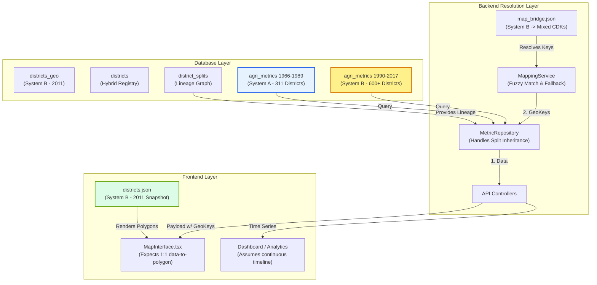

# Architectural Administrative-Boundary Audit

> **Project:** I-ASCAP (Indian Agri-Spatial Comparative Analytics Platform)
> **Audit Focus:** District Universe Assumptions across the Application
> **Date:** 2026-06-04

## 1. District Universe Classifications

The application currently attempts to unify two incompatible geographical realities. We classify the universes as follows:

- **System A (Historical Fixed-Boundary / Apportioned):** 
  Based on ICRISAT historical data (1966-2017). Assumes 311 fixed "parent" districts. Post-split data is back-apportioned to these historical boundaries.
- **System B (Modern Evolving-Boundary / Unapportioned):** 
  Based on ICRISAT modern data (1990-2019) and Census 2011. Assumes 596+ districts that splinter over time. Data is reported exactly as collected in the year it was collected.

---

## 2. Component Classification & Assumptions

| Component | Path | District Universe Assumed | Classification |
| :--- | :--- | :--- | :--- |
| **Frontend Map Polygons** | `districts.json` (GeoJSON) | Census 2011 snapshot (631 districts) | **B (Static Snapshot)** |
| **DB: Geo Layer** | `districts_geo` table | Census 2011 snapshot (641 features) | **B (Static Snapshot)** |
| **DB: District Registry** | `districts` table | Master registry (919 rows) including LGD, A, and B codes | **C (Hybrid)** |
| **DB: Time-Series Data (1966-1989)** | `agri_metrics` | 311 Harmonized parent districts | **A (Historical Fixed)** |
| **DB: Time-Series Data (1990-2017)** | `agri_metrics` | 600+ Splintering child districts | **B (Modern Evolving)** |
| **Backend: Map Bridge** | `map_bridge.json` | Tries to map 2011 polygons to varied CDKs (some A, some B) | **C (Hybrid)** |
| **Backend: Mapping Service** | `mapping_service.py` | Receives raw B data, attempts to map to 2011 GeoJSON keys using `district_splits` fallback | **C (Hybrid)** |
| **Backend: Query Translator** | `db_compat.py` | Translates LGD schema queries into CDK schema queries | **D (Agnostic)** |
| **Frontend: Choropleth Join** | `MapInterface.tsx` | Assumes a 1:1 mapping between backend metrics and GeoJSON polygons | **B (Assumes 2011)** |
| **Analytics: Time-Series Logic** | e.g. `get_time_series_pivoted` | Assumes CDKs represent stable geographies across time | **C (Implicitly Hybrid)** |

---

## 3. Dependency Graph



---

## 4. Critical Architectural Mismatches

The audit has identified several critical defects where incompatible district universes collide:

### Mismatch 1: Data Overwrite on the Map (System B Data → System B 2011 Map)
**Location:** `metric_repo.py` (Split Fallback) & `useDistrictMetrics.ts` (Frontend Join)
- **The Issue:** For the 1990-2017 period, `agri_metrics` provides data for all modern child districts (System B). When a child district doesn't exist in the 2011 GeoJSON map, `metric_repo.py` uses lineage data to map the child to the parent's `geo_key`.
- **The Failure:** The backend returns multiple rows (e.g., 4 child districts) all sharing the *same* `feature_id` (the parent polygon). In the frontend, `useDistrictMetrics.ts` does:
  ```typescript
  rawData.forEach(d => { join[featureId] = d; });
  ```
- **Result:** It silently overwrites the data! The map polygon will display the metric of whichever child district was processed last, rather than aggregating them. A parent polygon (e.g., Adilabad) will incorrectly show the production of just one small slice of itself.

### Mismatch 2: The 1989-1990 Time-Series Discontinuity (System A → System B)
**Location:** Any Analytics function (e.g., YoY Growth, Forecasting)
- **The Issue:** The timeline is continuous from 1966 to 2017, but the underlying district universe changes abruptly at 1990.
- **The Failure:** In 1989, a parent district's data represents the entire aggregate area (System A). In 1990, the database suddenly switches to System B, where that same parent CDK might only represent its residual boundary (having shed its children). 
- **Result:** Time-series charts and YoY growth calculations will show massive, artificial crashes in 1990 for any district that underwent a split. The analytical engines assume geographic stability over time, which is violated here.

### Mismatch 3: Map Bridge Ambiguity (System B Map → Hybrid DB)
**Location:** `map_bridge.json` & `districts` table
- **The Issue:** The `map_bridge.json` file links GeoJSON keys to CDKs. However, many of the target CDKs (like `AN_adilab_1951`) have 0 rows in the `agri_metrics` table, because the data is actually stored under `TG_adilab_2011`.
- **The Failure:** `MappingService.resolve_geo_key` avoids complete failure only by falling back to fuzzy string matching ("Adilabad" == "adilabad"). The strict ID linkage is broken.

### Mismatch 4: Missing Historical Geographies
**Location:** 1966-1989 Historical Extension
- **The Issue:** 13 major historical parent districts (e.g., Bombay, 24 Parganas, Midnapur) were dropped during the historical ingestion because they have no modern equivalent in the `districts` registry.
- **Result:** These vast areas will render as "No Data" gaps on the map for the entire 1966-1989 period.

## Conclusion

The application attempts to use a **"Late-Binding Spatial Join"**—storing disparate geographical data and trying to resolve it onto a single static map at runtime. 

To achieve research-grade accuracy, you cannot project splintered child data onto a parent polygon without strict mathematical aggregation, nor can you treat System A and System B as a continuous time-series without a harmonized panel.
