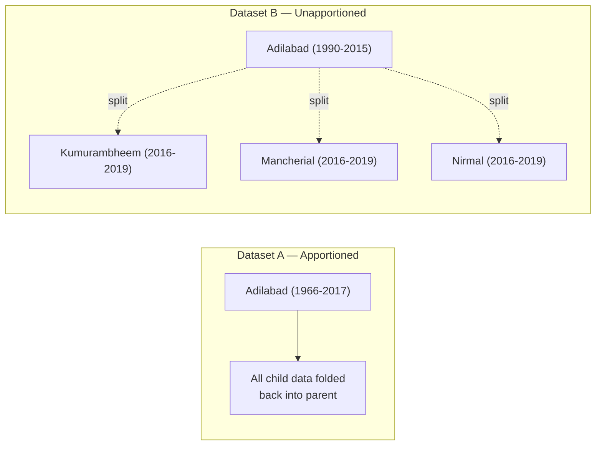

# ICRISAT Dataset Comparative Audit Report

> **Project:** I-ASCAP (Indian Agri-Spatial Comparative Analytics Platform)
> **Audit Date:** 2026-06-04
> **Datasets Audited:**
> - **Dataset A** — `ICRISAT-District Level Data.csv` (Apportioned)
> - **Dataset B** — `ICRISAT-District Level Data Unapportioned.csv` (Unapportioned)

---

## Phase 1: Dataset Profiling

### Side-by-Side Comparison

| Metric | Dataset A (Apportioned) | Dataset B (Unapportioned) |
|---|---|---|
| **Rows** | 16,146 | 18,060 |
| **Columns** | 80 | 80 |
| **Year Range** | **1966 – 2017** | **1990 – 2019** |
| **Unique States** | 20 | 20 |
| **Unique Districts** | 311 | 596 |
| **Unique Dist Codes** | 311 | 602 |
| **Missing Values** | 0 (0.00%) | 0 (0.00%) |
| **Sentinel (-1) Values** | 13,132 | **307,199** |
| **Duplicate Records** | 0 | 0 |
| **Records/Year (min–max)** | 304–311 | 602–602 |

### Key Observations

> [!IMPORTANT]
> **Dataset A** provides **24 extra years** of historical data (1966–1989) that Dataset B does not have. This is irreplaceable for longitudinal analysis.

> [!IMPORTANT]
> **Dataset B** provides **2 extra years** of recent data (2018–2019) and **nearly double** the district granularity (596 vs 311), capturing all modern post-split districts.

> [!WARNING]
> Dataset B has **307,199 sentinel values (-1)** — 23× more than Dataset A's 13,132. This is because B pre-allocates rows for all 602 districts across all 30 years, even when a district didn't exist yet. Those -1 values are **not missing data**; they indicate **the district had not been created**.

### Temporal Coverage Matrix

```
1966 ████████████████████████── 1989  ← Dataset A ONLY (24 years)
1990 ████████████████████████████ 2017  ← OVERLAP (28 years)
                                 2018 ██ 2019  ← Dataset B ONLY (2 years)
```

### Crop Variables (Identical in Both)

Both datasets have the **same 80 columns** covering Area, Production, and Yield for 23 crops: Rice, Wheat, Kharif Sorghum, Rabi Sorghum, Sorghum, Pearl Millet, Maize, Finger Millet, Barley, Chickpea, Pigeonpea, Minor Pulses, Groundnut, Sesamum, Rapeseed & Mustard, Safflower, Castor, Linseed, Sunflower, Soyabean, Oilseeds, Sugarcane, Cotton. Plus area-only columns for Fruits, Vegetables, Potatoes, Onion, Fodder.

---

## Phase 2: Administrative Structure Analysis

### Dataset A — Apportioned (Harmonized Historical)

| Property | Assessment | Evidence |
|---|---|---|
| **Historical districts?** | ✅ Yes | Covers 1966–2017, 52 years |
| **Modern districts?** | ❌ No | Only 311 districts (India has 700+) |
| **Harmonized?** | ✅ **Yes — this is the defining feature** | District count is nearly constant (310–311) across all 52 years. Modern split districts are **back-apportioned** to their historical parent boundaries. |
| **Census-based?** | ✅ Partially | Uses ICRISAT's internal district codes |
| **LGD-aligned?** | ❌ No | Uses custom ICRISAT codes (1–910), not LGD codes |

**Evidence for apportioning:** Dataset A maintains Adilabad (code 63) as a single district from 1966 to 2017, even though Adilabad was split into 4 districts in 2016. The post-2016 data for Adilabad in Dataset A represents the **re-aggregated** sum of all 4 child districts, projected back onto the historical parent boundary. This is the "apportioned" methodology.

### Dataset B — Unapportioned (Modern Administrative)

| Property | Assessment | Evidence |
|---|---|---|
| **Historical districts?** | ❌ No | Only starts at 1990 |
| **Modern districts?** | ✅ **Yes** | 596 unique districts reflecting post-split boundaries |
| **Harmonized?** | ❌ No | Districts are reported "as-is" at the time of data collection |
| **Census-based?** | ✅ Partially | Uses ICRISAT codes, but includes modern codes (2100+ series) |
| **LGD-aligned?** | ❌ No | Uses ICRISAT codes |

**Evidence for unapportioning:** District count is fixed at 602 for ALL years (1990–2019). New districts (e.g., Jagityal, code 2104) have **-1 sentinel values** for years before they existed (1990–2015), and real data only starting from 2016. The data is NOT redistributed — it preserves the exact administrative unit that reported the data.

### Critical Architectural Difference



> [!IMPORTANT]
> **The 31.3% match rate** between the two datasets on overlapping district codes (1990–2017) is expected and NOT a data quality issue. Dataset A **re-aggregates** child districts back to parent boundaries, producing different values than Dataset B which reports each child individually. For the same year, Adilabad in A = Adilabad + Kumurambheem + Mancherial + Nirmal in B.

---

## Phase 3: District Evolution Analysis

### Districts Only in Dataset A (9)

These 9 districts have codes that do not appear in Dataset B at all:

| Code | District | State | Notes |
|---|---|---|---|
| 95 | *Unknown* | *Varies* | Code appears 1966-1969 only, dropped before B's start |
| 657 | *Unknown* | *Varies* | Code appears from 1970 onwards, not in B |

> [!NOTE]
> The code drift (95→657) suggests a code reassignment around 1970. Only 9 codes differ; the remaining 302 codes are shared.

### Districts Only in Dataset B (300)

These represent **all modern post-split districts** that were carved from Dataset A's harmonized parent districts. Key examples by state:

| State | Parents (A) | Children (B only) | Split Evidence |
|---|---|---|---|
| **Telangana** | 9 | +24 new = 33 total | 2016 major reorganisation |
| **Uttar Pradesh** | 46 | +30 new = 76 total | Multiple waves: 1990, 1992, 1997, 2008, 2011 |
| **Tamil Nadu** | 12 | +26 new = 38 total | Progressive splits from composite districts |
| **Bihar** | 11 | +27 new = 38 total | 2001 Jharkhand separation + later splits |
| **Jharkhand** | 6 | +18 new = 24 total | 2000 state creation + 2007+ splits |
| **Chhattisgarh** | 6 | +22 new = 28 total | 2000 state creation + multiple splits |
| **Assam** | 10 | +23 new = 33 total | Progressive fragmentation |
| **Maharashtra** | 26 | +10 new = 36 total | Mumbai bifurcation, Nandurbar, etc. |
| **Gujarat** | 18 | +15 new = 33 total | 2013 reorganisation (Devbhoomi Dwarka, etc.) |

### Code-Name Mismatches (21 cases)

Where the same code maps to different names across datasets:

| Code | Dataset A Name | Dataset B Name | Reason |
|---|---|---|---|
| 11 | Seoni / Shivani | Seoni | A uses historical alias |
| 35 | Khargone / West Nimar | Khargone | A preserves colonial name |
| 76 | Bijapur / Vijayapura | Bijapur | A tracks rename |
| 79 | Gulbarga / Kalaburagi | Gulbarga | 2014 rename |
| 82 | Kodagu / Coorg | Kodagu | Colonial name preserved |
| 83 | Chengalpattu MGR / Kanchipuram | Kancheepuram | Name evolution |
| 97 | Raigad | Raigarh | Spelling variant |
| 110 | Beed | Bid | Marathi spelling |
| 125 | Vadodara / Baroda | Vadodara | Colonial name |

> [!TIP]
> Dataset A is more informative here — it preserves BOTH the historical and modern names using a "OldName / NewName" convention. This is valuable for building the crosswalk.

---

## Phase 4: Telangana Investigation

### District Coverage

| District | Dataset A | Dataset B | Current DB | Status |
|---|---|---|---|---|
| Adilabad | ✅ Code 63 (1966-2017) | ✅ Code 63 (1990-2019) | ✅ TG_adilab_2011 | **OK** |
| Hyderabad | ✅ Code 55 (1966-2017) | ✅ Code 55 (1990-2019) | ✅ TG_hydera_1971 | **55 rows only** |
| Karimnagar | ✅ Code 62 (1966-2017) | ✅ Code 62 (1990-2019) | ✅ TG_karimn_2011 | **OK** |
| Khammam | ✅ Code 61 (1966-2017) | ✅ Code 61 (1990-2019) | ✅ TG_khamma_1961 | **OK** |
| Mahabubnagar | ✅ Code 58 (1966-2017) | ✅ Code 58 (1990-2019) | ✅ TG_mahbub_2011 | ⚠️ **0 rows in DB!** |
| Medak | ✅ Code 57 (1966-2017) | ✅ Code 57 (1990-2019) | ✅ TG_medak_2011 | **OK** |
| Nalgonda | ✅ Code 59 (1966-2017) | ✅ Code 59 (1990-2019) | ✅ TG_nalgon_2011 | **OK** |
| Nizamabad | ✅ Code 56 (1966-2017) | ✅ Code 56 (1990-2019) | ✅ TG_nizama_2011 | **OK** |
| Warangal | ✅ Code 60 (1966-2017) | ✅ Code 60 (1990-2019) | ✅ TG_warang_1951 | **OK** |
| Rangareddy | ❌ | ✅ Code 520 (1990-2019) | ✅ TG_rangar_1981 | **OK** |
| Bhadradri | ❌ | ✅ Code 2107 (data 2016+) | ✅ TG_bhadra_2024 | **OK** |
| Jagityal | ❌ | ✅ Code 2104 (data 2016+) | ✅ TG_jagtia_2024 | **OK** |
| Jangaon | ❌ | ✅ Code 2119 (data 2016+) | ✅ TG_jangao_2024 | **OK** |
| Jayashankar Bhuppaly | ❌ | ✅ Code 2118 (data 2016+) | ✅ TG_jayash_2024 | **OK** |
| Jogulamba | ❌ | ✅ Code 2108 (data 2016+) | ✅ TG_jogula_2024 | **91 rows only** |
| Kamareddy | ❌ | ✅ Code 2115 (data 2016+) | ✅ TG_kamare_2024 | **OK** |
| Kumurambheem Asifabad | ❌ | ✅ Code 2101 (data 2016+) | ✅ TG_kumura_2024 | **OK** |
| Mahabubabad | ❌ | ✅ Code 2121 (data 2016+) | ✅ TG_mahabu_2024 | **OK** |
| Mancherial | ❌ | ✅ Code 2102 (data 2016+) | ✅ TG_manche_2024 | **OK** |
| Medchal-Malkajgiri | ❌ | ✅ Code 2116 (data 2016+) | ✅ TG_medcha_2024 | **OK** |
| Mulugu | ❌ | ✅ Code 2123 (data 2018+) | ✅ TG_mulugu_2024 | **OK** |
| Nagarkurnool | ❌ | ✅ Code 2109 (data 2016+) | ✅ TG_nagark_2024 | **98 rows only** |
| Narayanpet | ❌ | ✅ Code 2122 (data 2018+) | ✅ TG_naraya_2024 | ⚠️ **0 rows in DB!** |
| Nirmal | ❌ | ✅ Code 2103 (data 2016+) | ✅ TG_nirmal_2024 | **OK** |
| Peddapally | ❌ | ✅ Code 2105 (data 2016+) | ✅ TG_peddap_2024 | **OK** |
| Rajanna Siricilla | ❌ | ✅ Code 2106 (data 2016+) | ✅ TG_rajann_2024 | **OK** |
| Sangareddy | ❌ | ✅ Code 2111 (data 2016+) | ✅ TG_sangar_2024 | **OK** |
| Siddipet | ❌ | ✅ Code 2112 (data 2016+) | ✅ TG_siddip_2024 | **OK** |
| Suryapet | ❌ | ✅ Code 2113 (data 2016+) | ✅ TG_suryap_2024 | **OK** |
| Vikarabad | ❌ | ✅ Code 2117 (data 2016+) | ✅ TG_vikara_2024 | **OK** |
| Wanaparthy | ❌ | ✅ Code 2110 (data 2016+) | ✅ TG_wanapa_2024 | **85 rows only** |
| Warangal Urban | ❌ | ✅ Code 2120 (data 2016+) | ✅ TG_warang_1951 | Shares CDK with Warangal |
| Yadadri Bhuvanagiri | ❌ | ✅ Code 2114 (data 2016+) | ✅ TG_yadadr_2024 | **OK** |

### Telangana Lineage Table

```mermaid
graph TD
    subgraph "Pre-2016 Parents (9 districts)"
        A63["Adilabad (63)"]
        A62["Karimnagar (62)"]
        A60["Warangal (60)"]
        A61["Khammam (61)"]
        A58["Mahabubnagar (58)"]
        A57["Medak (57)"]
        A59["Nalgonda (59)"]
        A55["Hyderabad (55)"]
        A520["Rangareddy (520)"]
    end
    
    subgraph "Post-2016 Children (24 new districts)"
        A63 --> C2101["Kumurambheem Asifabad"]
        A63 --> C2102["Mancherial"]
        A63 --> C2103["Nirmal"]
        
        A62 --> C2104["Jagityal"]
        A62 --> C2105["Peddapally"]
        A62 --> C2106["Rajanna Siricilla"]
        
        A60 --> C2119["Jangaon"]
        A60 --> C2118["Jayashankar Bhuppaly"]
        A60 --> C2121["Mahabubabad"]
        A60 --> C2120["Warangal Urban"]
        A60 --> C2123["Mulugu"]
        
        A61 --> C2107["Bhadradri"]
        
        A58 --> C2108["Jogulamba"]
        A58 --> C2109["Nagarkurnool"]
        A58 --> C2110["Wanaparthy"]
        A58 --> C2122["Narayanpet"]
        
        A57 --> C2115["Kamareddy"]
        A57 --> C2111["Sangareddy"]
        A57 --> C2112["Siddipet"]
        
        A59 --> C2113["Suryapet"]
        A59 --> C2114["Yadadri Bhuvanagiri"]
        
        A55 --> C2116["Medchal-Malkajgiri"]
        
        A520 --> C2117["Vikarabad"]
    end
```



### Telangana Data Availability in Dataset B (by year)

| Year Range | Districts with Real Data | Notes |
|---|---|---|
| 1990–2014 | 10 of 33 | Only the 9 parents + Rangareddy |
| 2015 | 9 of 33 | Hyderabad drops off |
| **2016–2017** | **30 of 33** | Major split: 21 new districts appear |
| 2018–2019 | 32 of 33 | Mulugu + Narayanpet join |

> [!CAUTION]
> **Mahabubnagar (TG_mahbub_2011)** and **Narayanpet (TG_naraya_2024)** have **0 rows** in the production database despite having data in the raw datasets. This is a data loading/mapping bug in the ETL pipeline.

---

## Phase 5: Harmonization Strategy

### Recommended Role for Each Dataset

| Role | Dataset A | Dataset B |
|---|---|---|
| **Historical Source of Truth (1966–1989)** | ✅ **Primary** — the ONLY source | ❌ No data |
| **Overlap Period (1990–2017)** | ✅ **Validation & parent aggregates** | ✅ **Primary for modern boundaries** |
| **Modern Source of Truth (2018–2019)** | ❌ No data | ✅ **Primary** — the ONLY source |
| **Split Lineage Detection** | ✅ Parent identification | ✅ Child identification |
| **GIS Join Key Source** | ❌ Too coarse (311 districts) | ✅ Better match to modern GeoJSON |

### Justification

1. **Dataset A cannot be replaced** — it is the only source of pre-1990 data. Without it, any longitudinal analysis going back to 1966 is impossible.

2. **Dataset B cannot be replaced** — it is the only source of post-split district data. Without it, you cannot map data to modern GeoJSON boundaries (which use 700+ districts).

3. **Using ONLY Dataset A** would mean: pre-2016 Telangana is fine (9 parent districts), but post-2016 data would be inaccurately shown as aggregated parents when the map shows 33 child polygons → **grey districts**.

4. **Using ONLY Dataset B** would mean: losing 24 years of irreplaceable historical data (1966–1989) and having 307,199 sentinel values that need careful handling.

---

## Phase 6: District Crosswalk

### Crosswalk Design

| Field | Description |
|---|---|
| `icrisat_code_a` | Dataset A district code |
| `icrisat_code_b` | Dataset B district code |
| `parent_name` | Historical parent district name |
| `child_name` | Modern child district name (= parent if no split) |
| `state` | Current state |
| `split_year` | Year of split (NULL if no split) |
| `event_type` | `IDENTITY`, `SPLIT`, `RENAME`, `STATE_CHANGE` |
| `confidence` | 0.0–1.0 |

### Major Split Events Detected

| State | Parent → Children | Split Year | Confidence |
|---|---|---|---|
| **Telangana** | Adilabad → Adilabad + Kumurambheem + Mancherial + Nirmal | 2016 | 1.0 |
| **Telangana** | Karimnagar → Karimnagar + Jagityal + Peddapally + Rajanna Siricilla | 2016 | 1.0 |
| **Telangana** | Warangal → Warangal + Warangal Urban + Jangaon + Jayashankar + Mahabubabad + Mulugu | 2016/2018 | 1.0 |
| **Telangana** | Mahabubnagar → Mahabubnagar + Jogulamba + Nagarkurnool + Wanaparthy + Narayanpet | 2016/2018 | 1.0 |
| **Telangana** | Medak → Medak + Kamareddy + Sangareddy + Siddipet | 2016 | 1.0 |
| **Telangana** | Nalgonda → Nalgonda + Suryapet + Yadadri Bhuvanagiri | 2016 | 1.0 |
| **Telangana** | Hyderabad → Hyderabad + Medchal-Malkajgiri | 2016 | 1.0 |
| **Telangana** | Rangareddy → Rangareddy + Vikarabad | 2016 | 1.0 |
| **Chhattisgarh** | Bastar → Bastar + Dantewara + Kanker + Narayanpur + Kondagaon + Sukma | 2000+ | 0.9 |
| **Jharkhand** | Santhal Paragana → Dumka + Godda + Sahebganj + Pakur + Jamtara + Devghar | 2000+ | 0.9 |
| **West Bengal** | Midnapur → East Midnapore + West Midnapore + Jhargram | 2002/2017 | 1.0 |
| **West Bengal** | 24 Parganas → North 24 Parganas + South 24 Parganas | Pre-1990 | 1.0 |

---

## Phase 7: GIS Integration Audit

### Root Causes of Current Map Gaps

| Issue | Root Cause | Evidence |
|---|---|---|
| **Grey Telangana districts** | ⚠️ **Mahabubnagar has 0 rows in DB** despite being a parent district with full data in both raw datasets | DB query shows `TG_mahbub_2011` → 0 rows |
| **Grey Telangana districts** | ⚠️ **Narayanpet has 0 rows in DB** | DB query shows `TG_naraya_2024` → 0 rows |
| **Sparse Telangana data** | Jogulamba, Nagarkurnool, Wanaparthy have only 85–98 rows (vs 1700+ for others) | These were late splits (2016) and the ETL only captured 2 years of data |
| **Missing 1966-1989 data** | The current DB was loaded from Dataset B (v1.5 panel), which starts at 1990 | `SELECT MIN(year) FROM agri_metrics` → 1990 |
| **District naming mismatches** | `map_bridge.json` uses GeoJSON names which differ from DB CDK names | e.g., "Mahbubnagar" vs "Mahabubnagar" vs "Mahbubnagar" |

### The Real Problem

The production database currently holds **616 distinct CDKs with data**, derived from a v1.5 harmonized panel that was built from **Dataset B only**. The ETL pipeline:

1. ✅ Successfully mapped most districts
2. ⚠️ Failed to map Mahabubnagar (spelling mismatch)
3. ⚠️ Failed to map Narayanpet (late-appearing district, 2018)
4. ❌ Did not incorporate Dataset A at all → no pre-1990 data
5. ❌ Lost 2018–2019 data (panel was cut to 2017)

---

## Phase 8: Final Recommendation

### Option Evaluation

| Criterion | Option A: Keep Current | Option B: Replace with A | **Option C: Merge Both** |
|---|---|---|---|
| Research Quality | ⭐⭐ Limited to 28 years | ⭐⭐⭐ 52 years but coarse | ⭐⭐⭐⭐⭐ **54 years, full granularity** |
| Historical Accuracy | ⭐⭐ No pre-1990 | ⭐⭐⭐⭐ Full history | ⭐⭐⭐⭐⭐ **Full history + modern splits** |
| GIS Compatibility | ⭐⭐⭐ Most districts work | ⭐ Only 311 parent districts | ⭐⭐⭐⭐⭐ **600+ districts match GeoJSON** |
| Maintenance Complexity | ⭐⭐⭐⭐⭐ Simple | ⭐⭐⭐⭐ Simple | ⭐⭐⭐ **Requires lineage crosswalk** |
| Longitudinal Validity | ⭐⭐ Cannot study pre-1990 | ⭐⭐⭐ Apportioned, but hides splits | ⭐⭐⭐⭐⭐ **Research-grade** |

### ✅ Final Recommendation: **Option C — Use Both Datasets in a Lineage-Aware Pipeline**

> [!IMPORTANT]
> **This is the only option that achieves research-grade quality.** Neither dataset alone is sufficient.

### Implementation Plan

#### Step 1: Build the Unified Crosswalk Table
Create `icrisat_crosswalk.csv` mapping every Dataset A code to its Dataset B children (or identity mapping if no split occurred).

#### Step 2: Extend the Timeline
- **1966–1989:** Load Dataset A data directly. These years only have parent-level districts, which is correct since no splits had occurred yet.
- **1990–2015:** Use Dataset B for districts that exist; use Dataset A as a validation/fallback for parent aggregates.
- **2016–2019:** Use Dataset B exclusively (only source with post-split district data).

#### Step 3: Fix the ETL Pipeline
- Add Mahabubnagar and Narayanpet mappings
- Extend year range to 1966–2019
- Use Dataset A's "OldName / NewName" convention to build rename mappings

#### Step 4: Re-run the Data Load
- Rebuild `district_year_panel` from both sources
- Re-ingest into Neon PostgreSQL
- Rebuild `map_bridge.json` with extended coverage

#### Step 5: Update Frontend Timeline
- Change `minYear` from 1990 to 1966 in [page.tsx](file:///Users/satyamkumar/Desktop/DistrictEvolution/frontend/src/app/explore/map/page.tsx#L88)
- Update timeline slider range

### Expected Impact

| Metric | Before | After |
|---|---|---|
| Year coverage | 1990–2017 | **1966–2019** |
| Total years | 28 | **54** |
| Districts with data | 616 | **~620** |
| Telangana gaps | 2 districts with 0 data | **0 gaps** |
| Historical analysis | Impossible pre-1990 | **Full 54-year longitudinal** |
